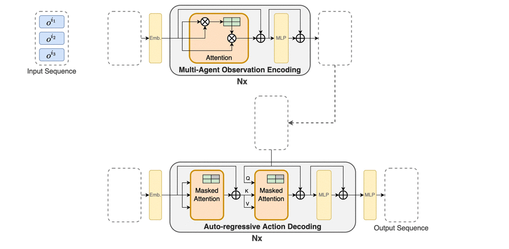
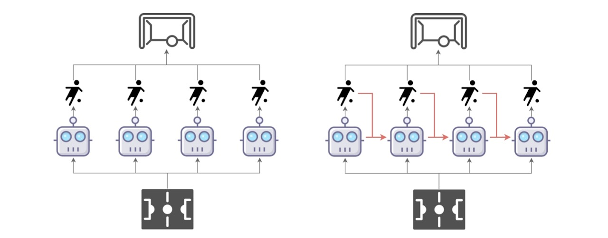
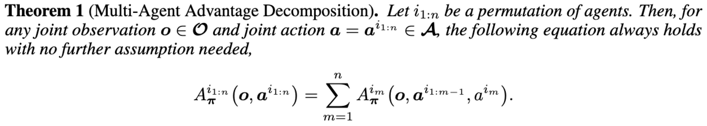
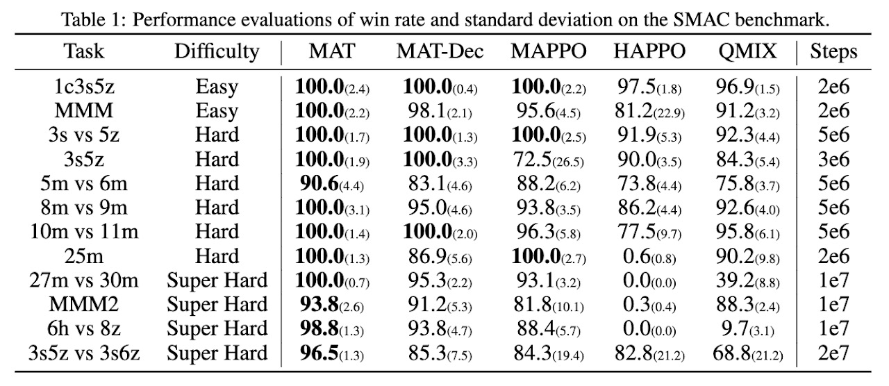
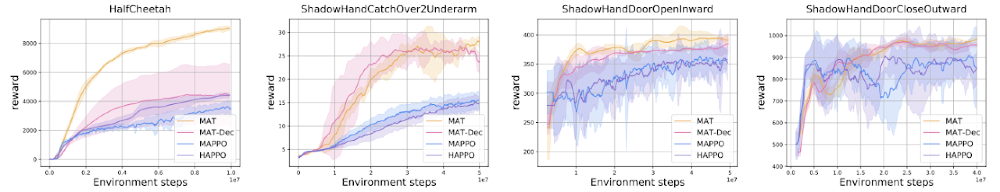
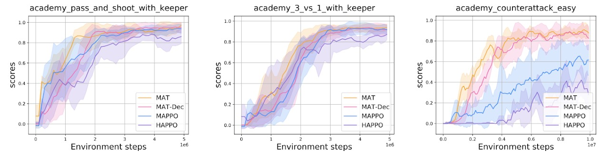

# Multi-Agent Transformer

This is the **official implementation** of MAT. MAT is a novel neural network based on the encoder-decoder architecture that implements a multi-agent learning process through sequence models, aiming to build the bridge between MARL and SM so that the modeling power of modern sequence models, the Transformer, can be unleashed for MARL. 

**For more details, please visit our page site about Muti-Agent Transformer: https://sites.google.com/view/multi-agent-transformer.**

In short, MAT:

* casts cooperative MARL into sequence modeling problems.

* is an encoder-decoder architecture building the bridge between MARL and the Transformer.

* is an online RL method trained by trails and errors, which is different from previous offline approaches, e.g. Decision Transformer or GATO (more like supervised learning). 

* leverages the multi-agent advantage decomposition theorem [Kuba et.al] to render only linear time complexity for multi-agent problems and ensure a monotonic performance improvement guarantee.

* achieves superior performance and generalisation capability on benchmarks including StarCraftII, Multi-Agent MuJoCo, Dexterous Hands Manipulation, and Google Research Football.

We present GIFs below to show the architecture and dynamic data flow of MAT.
||
|:-------------------------: |
|Architecture of MAT|    
 

## Installation

### Dependences
``` Bash
pip install -r requirements.txt
```

### Multi-agent MuJoCo
Following the instructios in https://github.com/openai/mujoco-py and https://github.com/schroederdewitt/multiagent_mujoco to setup a mujoco environment. In the end, remember to set the following environment variables:
``` Bash
LD_LIBRARY_PATH=${HOME}/.mujoco/mujoco200/bin;
LD_PRELOAD=/usr/lib/x86_64-linux-gnu/libGLEW.so
```

### StarCraft II & SMAC
Run the script
``` Bash
bash install_sc2.sh
```
Or you could install them manually to other path you like, just follow here: https://github.com/oxwhirl/smac.

### Google Research Football
Please following the instructios in https://github.com/google-research/football. 

### Bi-DexHands 
Please following the instructios in https://github.com/PKU-MARL/DexterousHands. 

## How to run
When your environment is ready, you could run shells in the "scripts" folder with algo="mat" or algo="mat_dec". For example:
``` Bash
./train_mujoco.sh  # run MAT/MAT-Dec on Multi-agent MuJoCo
```
If you would like to change the configs of experiments, you could modify sh files or look for config.py for more details.

### SMACv2 and EPO

Install the official SMACv2 environment in the same Python environment as this
repository:

```bash
pip install -r requirements-smacv2.txt
```

Install the official SMACv2 `SMAC_Maps` release in StarCraft II as well. The
folder must include `32x32_flat.SC2Map`; follow the map link and `SC2PATH`
instructions in `mat/envs/smacv2/README.md`.

`train_smac.py` adapts the official SMACv2 API to the runner used by both
`mat_dec` and `mappo_dgnn_dsgd`. The default SMACv2 configuration is the
strongest Terran EPO setting: `prob_obs_enemy=0.0` and `action_mask=False`.
Bundled aliases are `terran_epo`, `protoss_epo`, and `zerg_epo`; omit `_epo`
for the corresponding standard SMACv2 configuration.

MAT-Dec example:

```bash
python mat/scripts/train/train_smac.py \
  --env_name smacv2 \
  --smacv2_config terran_epo \
  --algorithm_name mat_dec \
  --experiment_name mat_dec_terran_epo \
  --seed 0 \
  --n_rollout_threads 32 \
  --episode_length 200 \
  --num_env_steps 10000000 \
  --mini_batch_size 3200 \
  --lr 5e-4 \
  --ppo_epoch 10 \
  --gamma 0.99 \
  --gae_lambda 0.95 \
  --clip_param 0.05 \
  --entropy_coef 0.01 \
  --max_grad_norm 10 \
  --n_block 1 \
  --n_head 1 \
  --n_embd 64 \
  --n_quants 1 \
  --use_value_active_masks \
  --use_eval
```

MAPPO-DGNN-DSGD example:

```bash
python mat/scripts/train/train_smac.py \
  --env_name smacv2 \
  --smacv2_config terran_epo \
  --algorithm_name mappo_dgnn_dsgd \
  --experiment_name mappo_dgnn_dsgd_terran_epo \
  --truelyDistributed True \
  --consensusLoss True \
  --gnn_loss_coef 1 \
  --num-layers 3 \
  --iterations 5 \
  --seed 0 \
  --n_training_threads 16 \
  --n_rollout_threads 32 \
  --num_mini_batch 2 \
  --episode_length 200 \
  --num_env_steps 10000000 \
  --mini_batch_size 3200 \
  --lr 5e-4 \
  --ppo_epoch 10 \
  --gamma 0.99 \
  --gae_lambda 0.95 \
  --clip_param 0.05 \
  --entropy_coef 0.01 \
  --max_grad_norm 10 \
  --encode_state True \
  --hidden_size 64 \
  --n_embd 64 \
  --out_channels 64 \
  --num-heads 1 \
  --n_quants 1 \
  --detach True \
  --share_policy \
  --use_value_active_masks \
  --use_eval
```

For graph algorithms, ally edges use the smaller SMACv2 sight range of each
unit pair. Set `--smacv2_comm_range R` to use a fixed communication radius.
Disconnected graphs remain disconnected by default; use
`--smacv2_force_connected_graph` only for an explicit connectivity ablation.
Override EPO severity with `--smacv2_prob_obs_enemy P`. Enabling
`--smacv2_action_mask` reintroduces the target-availability side channel and is
therefore not recommended for the strongest partial-observability test.

### DG-MAT

`dg_mat` combines DG-MAPPO-style graph-local execution and D-SGD parameter
mixing with separate actor and critic attention paths. Every agent first uses
its own self-attention encoder over tokenized features from only its local
observation. The resulting sender-owned latent state is communicated to
one-hop neighbors and aggregated by graph-masked attention, with a self-loop
always included. All encodings are recomputed inside PPO, so both local and
communication attention networks receive end-to-end gradients.

Example for SMAC:

```bash
python mat/scripts/train/train_smac.py \
  --env_name StarCraft2 \
  --algorithm_name dg_mat \
  --experiment_name dg_mat \
  --map_name 10m_vs_11m \
  --eval_map_name 10m_vs_11m \
  --unit_sight_range 9 \
  --n_rollout_threads 32 \
  --buffer_device cpu \
  --episode_length 100 \
  --mini_batch_size 128 \
  --ppo_epoch 10 \
  --clip_param 0.05 \
  --lr 5e-4 \
  --n_block 1 \
  --n_embd 64 \
  --n_head 1 \
  --dg_mat_obs_tokens 8 \
  --entropy_coef 0.01 \
  --consensusLoss True \
  --use_eval
```

Do not pass `--encode_state` to DG-MAT. DG-MAT intentionally learns its actor
and critic representations from graph-local observations.

DG-MAT uses CPU rollout-buffer storage by default when `--buffer_device auto`
(the default). PPO moves only the sampled minibatch tensors needed by DG-MAT
to CUDA. Pass `--buffer_device cpu` explicitly in cluster scripts to make this
choice visible in logged configurations.

#### Agent-parallel DG-MAT

DG-MAT can persistently assign complete agent models to different GPUs. Local
observation attention, receiver communication, actor/critic heads, optimizer
state, and their attention activations stay on the owning GPU. Compact detached
peer messages, output/context tensors, and the tensors needed for graph-neighbor
D-SGD parameter mixing move between GPUs.

Request two or more GPUs and add:

```bash
python mat/scripts/train/train_smac.py \
  --algorithm_name dg_mat \
  --agent_parallel \
  --agent_parallel_devices 0,1 \
  --buffer_device cpu \
  ...
```

CUDA indices are logical indices after `CUDA_VISIBLE_DEVICES` is applied. If
`--agent_parallel_devices` is omitted, all visible GPUs are used and agents are assigned
round-robin. This implementation uses one Python process, so launch it with
ordinary `python`/`srun python`, not `torchrun`. Check the startup line
`[agent parallel] agent owners=...` to verify placement. Checkpoints are saved on CPU
and can be restored with a different number or arrangement of GPUs.

The ready-to-edit SLURM example is
`mat/scripts/train_dg_mat_agent_parallel.slurm`.

The same ownership model is available for `mappo_dgnn_dsgd`:

```bash
python mat/scripts/train/train_smac.py \
  --algorithm_name mappo_dgnn_dsgd \
  --agent_parallel \
  --agent_parallel_devices 0,1 \
  --buffer_device cpu \
  ...
```

For MAPPO-DGNN-DSGD, every agent's actor, critic, local GNN encoder, GNN
classifier, attention vectors, and optimizer state live on its owner GPU. The
existing rollout-time graph propagation remains on the primary GPU and uses
transient attention-vector copies; its encoded output is still detached before
buffer insertion, preserving the baseline algorithm's training semantics. See
`mat/scripts/train_mappo_dgnn_dsgd_agent_parallel.slurm` for a complete launch.


## Multi-Agent Sequential Decision Paradigm

Conventional multi-agent learning paradigm (left) wherein all agents take actions simultaneously vs. the multi-agent sequential decision paradigm (right) where agents take actions by following a sequential order, each agent accounts for decisions from preceding agents as red arrows suggest. 



The key insight of the multi-agent sequential decision paradigm is the multi-agent advantage decomposition theorem (a discovery in [HATRPO/HAPPO](https://arxiv.org/abs/2109.11251) [ICLR 22, Kuba et.al], indicating the advantage of joint actions could be sequentially divided as shown below.



## Performance Comparisons on Cooperative MARL Benchmarks

MAT consistently outperforms its rivals, indicating its modeling capability for homogeneous-agent tasks (agents are interchangeable).

Videos on four super-hard scenarios are shown below.

|||||
|:-----------: |:-------------------: |:-----------: |:----------: |
|27m vs 30m|MMM2|6h vs 8z|3s5z vs 3s6z|    



Demonstration and Performance comparison on Multi-Agent Mujoco HalfCheetah and  Bimanual Dexterous Hands Manipulation tasks, showing MAT's advantages in robot control for heterogeneous agents (agents are not interchangeable).




Performance comparison on the Google Research Football tasks with 2-4 agents from left to right respectively, telling the same conclusion that MAT outperforms MAPPO and HAPPO.


## MAT as Excellent Few-short Learners

Few-shot performance comparison with models pre-trained on complete HalfCheetah. MAT exhibits powerful generalisation capability when parts of the robot fail.


Few-shot performance comparison with pre-trained models on multiple SMAC tasks. Sequence-modeling-based methods, MAT and MAT-Dec, enjoy superior performance over MAPPO, justifying their strong generalisation capability as few-shot learners.


## Citation
Please cite as following if you think this work is helpful for you:
```
@article{wen2022multi,
  title={Multi-Agent Reinforcement Learning is a Sequence Modeling Problem},
  author={Wen, Muning and Kuba, Jakub Grudzien and Lin, Runji and Zhang, Weinan and Wen, Ying and Wang, Jun and Yang, Yaodong},
  journal={arXiv preprint arXiv:2205.14953},
  year={2022}
}
```
